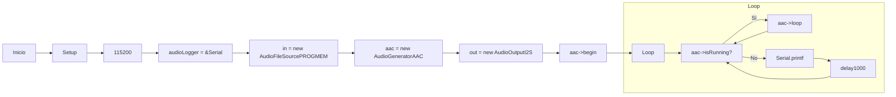
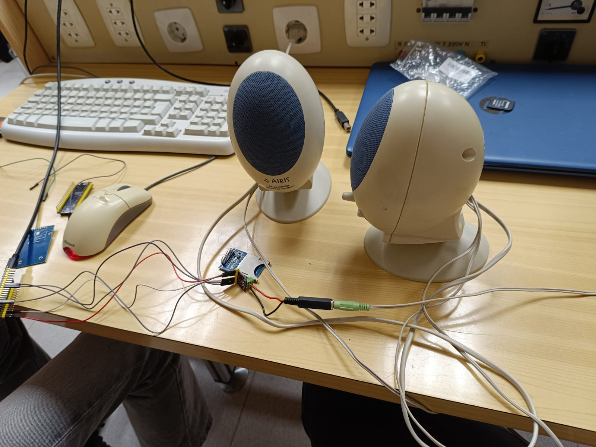

# Práctica 7: Reproducción Homer.
# Objetivo: 
- El objetivo de la practica actual es describir el funcionamiento del bus I2S y realizar una
practica para comprender su funcionamiento. 
- Reproducir por un altavoz un archivo des de la memoria interna. 
# Materiales: 
- ESP32-S3
- Altavoz I2S
- Amplificador I2S
- Libreria: 
```
    lib_deps = earlephilhower/ESP8266Audio@^1.9.0
```
# Procedimiento:
**Codigo:**
```cpp
    #include <Arduino.h>
    #include "AudioGeneratorAAC.h"
    #include "AudioOutputI2S.h"
    #include "AudioFileSourcePROGMEM.h"
    #include "sampleaac.h"

    AudioFileSourcePROGMEM *in;
    AudioGeneratorAAC *aac;
    AudioOutputI2S *out;

    void setup()
    {
    Serial.begin(115200);

    audioLogger = &Serial;
    in = new AudioFileSourcePROGMEM(sampleaac, sizeof(sampleaac));
    aac = new AudioGeneratorAAC();
    out = new AudioOutputI2S();

    aac->begin(in, out);
    }


    void loop()
    {
    if (aac->isRunning()) {
        aac->loop();
    } else {
        Serial.printf("AAC done\n");
        delay(1000);
    }
    }
```
**Descripción:**<br>
Reproducie un archivo de audio AAC almacenado en la memoria flash del microcontrolador utilizando una salida de audio I2S.
En la función ``setup()``, se inicializa la comunicación serial a 115200 baudios para la depuración. Luego, se configura el ``audioLogger`` para redirigir los mensajes de registro a la consola serial. Se crea una instancia de ``AudioFileSourcePROGMEM``, pasándole como parámetros el archivo de audio en formato AAC (sampleaac) y su tamaño. A continuación, se instancia el generador de audio AAC (AudioGeneratorAAC) y la salida de audio I2S (AudioOutputI2S). Finalmente, se inicia el proceso de generación de audio con aac->begin(in, out), que conecta la fuente de audio con la salida.
La función ``loop()`` se ejecuta de forma continua. Si el generador de audio AAC está en funcionamiento, se llama al método aac->loop() para procesar el audio. Si el generador ha terminado de reproducir el audio, se imprime "AAC done" en la consola serial y se introduce una demora de un segundo antes de continuar el bucle.

**Diagrama de flujos:**


## Foto del montage:


## Conclusión: 
Configura y maneja la reproducción de un archivo de audio AAC almacenado en memoria flash mediante la salida I2S.